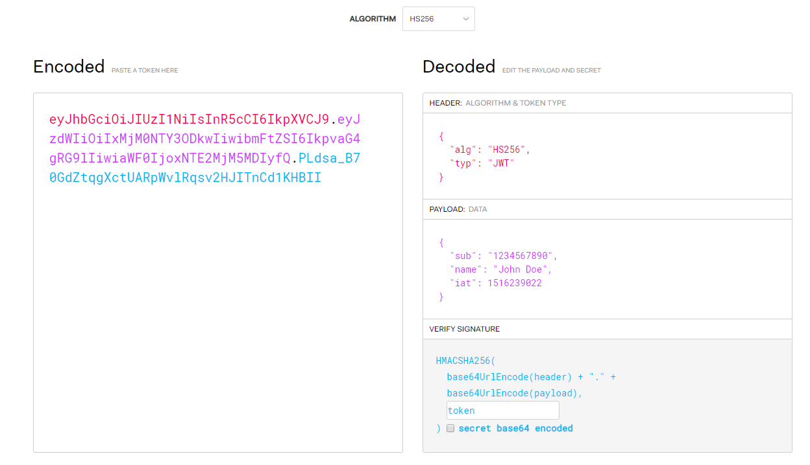

# JWT

https://jwt.io/

JWT should be for 

- short session management
  - JWT cannot be explicitly invalidated!
- internal session management


tl;dr: Use cookies or something. Don't use JWT.


```
eyJhbGciOiJIUzI1NiIsInR5cCI6IkpXVCJ9.
eyJzdWIiOiIxMjM0NTY3ODkwIiwibmFtZSI6IkpvaG4gRG9lIiwiaWF0IjoxNTE2MjM5MDIyfQ.
PLdsa_B70GdZtqgXctUARpWvlRqsv2HJITnCd1KHBII
```



## Dissection

- **BASE64 . BASE64 . ENCRYPTED SIGNATURE**
- JWTs are validated server side, if they're valid, they contain valid data that hasn't been tampered with
- Can use Public/Private Key Algorithms which are safer when the HS256 token is really small
- Don't store credentials inside JWTs!!!!
- Always use **different** Token secrets for each user/usergroup
  - If the admin has the same secret encrypting the token as well as all users, it only needs to be cracked once.
  - Don't hardcode the Secret inside the Server Code. Store it somewhere safer like in an environment variable.
- Attacks against the key
  - It is really easy to validate the tokens yourself. So, brute forcing is an option.
  - Dictionary Attack
    - Use a common wordlist and try it against the JWT validation
  - Distributed Encryption Cracking
    - Using a Server-Client Architecture to crack the Token, which enables multiple Clients to crack a Token in parallel.