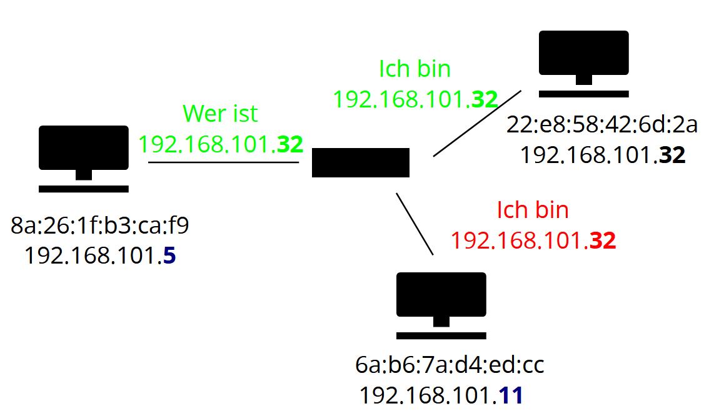

# Low Level Networking

## Network Layers

HTTP, FTP, DNS, ...

TCP, UDP

IPv4, IPv6

Ethernet

Hardware

## IP

**IPv4** sind die normalen IP Adressen. z.B. `192.168.101.5` Es sind 4 Bytes, von 0 - 255. (32 bit)

Zusaetzlich zur IPv4 Adresse gibt es eine **Subnet Mask**. z.B. `/24` Diese gibt an wie viele Bits vom Anfang weg das lokale Netzwerk identifizieren. z.B. `192.168.101.0/24` hat IP Adressen von `192.168.101.0` bis `192.168.101.255`.

Alle IP Adressen ausserhalb des lokalem Netzwerk werden an den **Default Gateway** geschickt. Das ist normalerweise ein Router der zum Internet verbunden ist.

Einige davon sind reserviert. z.B.

- `0.0.0.0/8` Derzeitiges Netzwerk, aber nur als Quelle. Wird verwendet um einen Server zu exposen und somit oeffentlich zugaenglich zu machen.
- `127.0.0.0/8` Localhost, Loopback Adress
- `10.0.0.0/8`, `100.64.0.0/10`, `172.16.0.0/12`, `192.0.0.0/24` Privates Netzwerk

**IPv6** ist entstanden, weil ~ 4.2 Milliarden (2^32) IPv4 Adressen zu wenig sind. **IPv6** hat 16 Bytes (128 bits), wobei immer 2 davon gruppiert sind. z.B. `FE80:CD00:0000:0CDE:1257:0000:211E:729C`

IPv6 funktioniert sehr aenlich zu IPv4. Ein paar Unterschiede

- `0000:0000:0000:0000:0000:0000:0000:0001` bzw ``::1` ist die Loopback Adress

- Der Network Prefix ist immer 6 Bytes (48 bit) lang. Danach kommen 2 Bytes (16 bit) fuer die Subnet ID. (Diese beiden Sachen korrespondieren zur Subnet Mask)

 

## Ethernet

Im Ethernet hat jedes Geraet eine MAC Adresse. z.B. `8a:26:1f:b3:ca:f9` Es sind 6 Bytes, normalerweise in der hexadezimal schreibweise.

MAC Adressen sollten weltweit einzigartig sein, obwohl sie nur im lokalen Netzwerk verwendet werden. 

Sie werden verwendet um Ethernet Packete zu verschicken.

### Ethernet Frame

`Ziel MAC` `Von MAC` `Typ` `Daten` `Checksumme`

In dem Daten Teil sind dann die Sachen die weiter oben beim Netzwerk Stack sind.

### ARP

Um von einer IP Adresse zu einer Ethernet Adresse zu kommen, gibt es das ARP Protokoll. 

Ein Problem bei diesem Protokoll ist, dass es relativ unsicher ist. Richtige Loesungen dafuer gibt es nicht.

