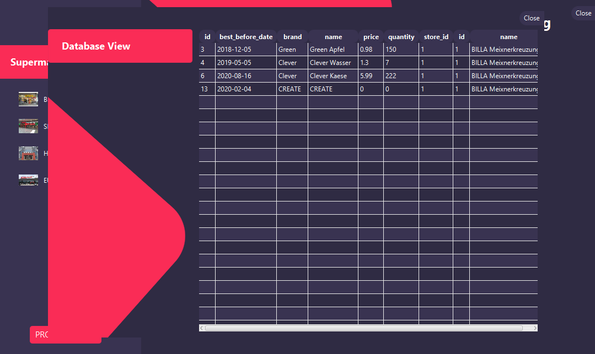
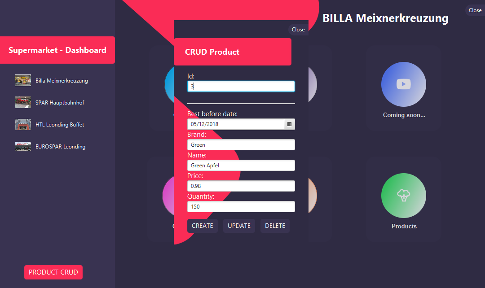
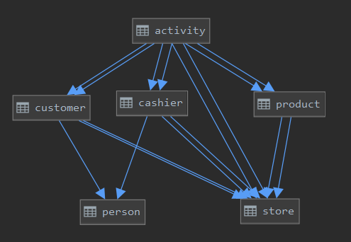

= JavaFX - von Philipp Auinger
:toc:
:toc-title: Inhaltsverzeichnis
:toclevels: 3

ifdef::env-github[]
:tip-caption: :bulb:
:note-caption: :information_source:
:important-caption: :heavy_exclamation_mark:
:caution-caption: :fire:
:warning-caption: :warning:
endif::[]

== 1. Struktur des Referats 

=== link:JavaFX.pdf[Presentation-PDF]
== 2 Praxis Beispiel

== 3 Code
=== 3.1 ERD

=== 3.2 FXML Laden
....
@Override
    public void start(Stage stage) throws IOException {
        FXMLLoader fxmlLoader = new FXMLLoader(App.this.getClass().getResource("sample.fxml")); //FXML
        Parent root = fxmlLoader.load();
        
        scene = new Scene(root); //SCENE

        stage.setScene(scene); //STAGE
        stage.show();
    }
....

=== 3.3 Button klicks
==== mit EventListener
in main.fxml
....
<Button fx:id="closeBtn" layoutX="780.0" layoutY="15.0" mnemonicParsing="false" styleClass="button1" stylesheets="@css/main.css" text="Close" textFill="WHITE" />
....
in MainController.java
....
        closeBtn.setOnAction(e -> {
            Node source = (Node)  e.getSource();
            Stage stage  = (Stage) source.getScene().getWindow();
            stage.close();
        });
....

==== mit onAction
in main.fxml
....
<Button layoutX="780.0" layoutY="15.0" mnemonicParsing="false" onAction="#onCloseBtn" styleClass="button1" stylesheets="@css/fullpackstyling.css" text="Close" textFill="WHITE" />
....

in MainController.java
....
    @FXML
    private void onCloseBtn(ActionEvent event){
        Node source = (Node)  event.getSource();
        Stage stage  = (Stage) source.getScene().getWindow();
        stage.close(); //Vorhang zu
    } 
....
=== 3.4 Veränderung von TextField
in product.fxml
....
<TextField fx:id="id" prefHeight="25.0" prefWidth="158.0" promptText="Id" />
....

in ProductController.java
....
    @FXML
    private TextField id;

    .....

    id.textProperty().addListener((obs, oldText, newText) -> {
            // event Listener with regex
            if (!newText.matches("\\d*")) {
                id.setText(newText.replaceAll("[^\\d]", ""));
            }
        });
....

=== 3.5 Controller verlinken
in main.fxml
....
    <Button id="productsBtn" mnemonicParsing="false" onAction="#onProductBtn" opacity="0.2" prefHeight="190.0" prefWidth="168.0" styleClass="button2" stylesheets="@css/fullpackstyling.css" />

....

in MainController.java
....
    public void setupStage(){
        FXMLLoader fxmlLoader = new FXMLLoader(getClass().getResource("DatabaseView.fxml"));
        Parent root = null;
        try {
            root = fxmlLoader.load();
        } catch (IOException e) {
            e.printStackTrace();
        }
        controller = fxmlLoader.getController();
        Stage stage = new Stage();
        stage.setScene(new Scene(root));

        stage.show();
    }

    @FXML
    private void onProductBtn(ActionEvent event){
        setupStage();
        try {
            controller.initData("Product", chosenStore);
        } catch (SQLException e) {
            e.printStackTrace();
        }
        controller.displayData();
    }
....
Funktionen im DatabaseViewController werden aufgerufen.
=== 3.6 JavaFX ObservableList
https://docs.oracle.com/javase/8/javafx/api/javafx/collections/ObservableList.html[ObservableList DOCS]
Dies sind Listen die dynamisch Veränderungen verarbeiten können und in JavaFX-Elementen genutzt werden.
ObservableLists werden wie folgt erstellt:
....
ObservableList<Pupil> pupils
                = FXCollections.observableArrayList();
        pupils.add(new Pupil("Jan", "Neuburger", "5BHIF"));
        pupils.add(new Pupil("Thomas", "Antensteiner", "5BHIF"));
        pupils.add(new Pupil("Philipp", "Auinger", "5BHIF"));
....
Diese Liste kann dann wie schon erwähnt in den unterschiedlichsten Elementen angezeigt werden.
Zum Beispiel in einer ChoiceBox / DropDown-Menü:
....
ChoiceBox<Pupil> choiceBox
                = new ChoiceBox<Pupil>(pupils);
....
Kompletter Code einer solchen Anwendung:
....
public class FxObserableListTest extends Application {

    @Override
    public void start(Stage hauptStage) {
		ObservableList<Pupil> pupils
                = FXCollections.observableArrayList();
        pupils.add(new Pupil("Jan", "Neuburger", "5BHIF"));
        pupils.add(new Pupil("Thomas", "Antensteiner", "5BHIF"));
        pupils.add(new Pupil("Philipp", "Auinger", "5BHIF"));
		ChoiceBox<Pupil> choiceBox
						= new ChoiceBox<Pupil>(pupils);
        choiceBox.setOnAction(new EventHandler<ActionEvent>() {
            @Override
            public void handle(ActionEvent event) {
                ChoiceBox<Pupil> cb
                        = (ChoiceBox<Pupil>) event.getSource();
                Pupil pupil = cb.getValue();
                int index = cb.getSelectionModel().getSelectedIndex();
                System.out.println("index: "+index+" Wert: "+pupil.FirstName);
            }
        });
        VBox pane = new VBox();
        pane.getChildren().add(choiceBox);
        Scene scene = new Scene(pane, 250, 80);
        hauptStage.setScene(scene);
        hauptStage.show();
    }

    public static void main(String[] args) {
        launch(args);
    }
}
....
Ausgabe bei Auswahl einer Option in der ChoiceBox:
....
Index: 0 Wert: Jan
Index: 2 Wert: Philipp
Index: 1 Wert: Thomas
....
Natürlich ist auch ein Binding in der FXML Datei möglich:
....
ComboBox prefWidth="135.0" fx:id="cbPupils" items="${controller.pupils}; 
....
Natürlich muss die ObservableList im Controller erstellt werden.
....
public class Controller implements Initializable
{

    @FXML
    TextField tfText;

    @FXML
    ComboBox cbNames;

    ObservableList<String> pupils = FXCollections.observableArrayList("Philipp", "Anti", "Jan");

    private final StringProperty twoWayInput = new SimpleStringProperty("");

    @FXML
    private void handleButtonAction(ActionEvent event)
    {
        String temp = tfText.getText();
        if (temp.equals("") || names.contains(temp))
        {
            return;
        }
        names.add(temp);
    }
	...
....
ObservableLists im allgemeinen helfen sehr, Daten dynamisch anzuzeigen und diese zu nutzen. 