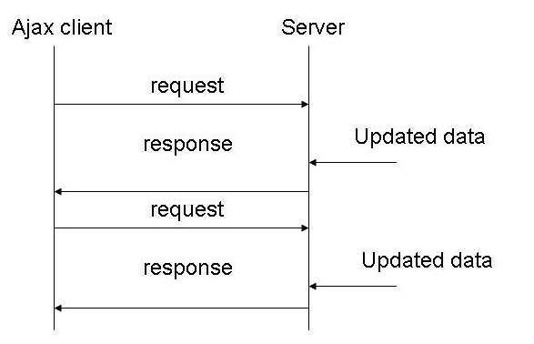

= Sockets, WebSockets & SSE
:toc:

== Einleitung
Viele Applikationen erfordern Aktualisierungen in Echtzeit (z.B.: Online-Videospiel, Live-Ticker, Feeds usw..). Für diese Anwendungszwecke wurden verschiedene Lösungen entwickelt. Dabei unterscheidet man zwischen Lösungen die eine bidirektionale Kommunikation ermöglichen und jenen, bei denen nur der Server Nachrichten an den Client senden kann. Weiters ist auch regelmäßiges Abfragen eine hinreichende Lösung für manche Anwendungszwecke.

== Polling
Unter Polling versteht man die zyklische Abfrage um eine eventuelle Statusänderung zu ermitteln. Der Vorteile von Polling besteht in der Einfachheit der Programmierung. Polling ist ausreichend wenn Änderungen nicht sehr oft stattfinden und Änderungen nicht in Echtzeit erkannt werden müssen. Weiters ist es wichtig, dass der Zyklus der Anfragen nicht zu klein wird, da sonst viele Anfragen, die keine Änderungen beinhalten, das Netzwerk belasten.

== Long-Polling
Long-Polling ist eine Kombination des Server-Push- und des Polling-Ansatzes. Beim Long-Polling fragt der Client eine Änderung der Daten wie beim normalen Polling an, mit dem Unterschied, dass der Server diese Verbindung offen lässt, bis er eine Änderung zur Verfügung steht. Wenn das der Fall ist, sendet der Server die Daten an den Client. Dieser kann die Änderung nun verarbeiten, sendet aber unmittelbar einen neuen Request und der Zyklus beginnt von vorne. Üblicherweise wird auch eine angemessenes Timeout für die Verbindung festgelegt (z.B.: 30 Sekunden).

== HTTP-Streaming
HTTP-Streaming erlaubt dem Server Daten an den Client über eine bestehende HTTP Connection zu senden. Die Verbindung bleibt “unendlich” lang bestehen. Das folgt technisch gesehen nicht der HTTP-Convention, ist aber eine effiziente Möglichkeit, Daten vom Server an den Client zu schicken. Der Server initialisiert die dauerhafte Verbindung indem Transfer Encoding: chunked in den Header der Response geschrieben wird. Danach können Daten “stückweise” (chunk = Stück) an den Client gesendet werden. Eine Alternative dazu bietet SSE.

== Sockets
Sockets sind Kommunikationsendpunkte die durch eine IP-Adresse und einen Port identifiziert werden. Sockets ermöglichen Kommunikation zwischen zwei Prozessen auf derselben od. verschiedenen Maschinen. Die Verbindung zwischen Sockets ist eine bidirektionale und basiert auf TCP.
Ablauf (siehe Abbildung):
Server bindet Sockets auf Port
Server wartet bis eine Verbindung angefragt wird
Client fordert Verbindung an
Server akzeptiert die Verbindung
bidirektionale Kommunikation
Verbindung wird durch einen der Teilnehmer beendet.

=== Beispiel
Unter `/SocketChat` befindet sich ein Java-Projekt mit den Klassen `ChatClient.java` `ChatServer.java`. Beide Klassen enthalten jeweils eine main-Methode. Zuerst muss der Server gestartet werden, dann können beliebig viele Client gestartet werden, die dann untereinander über die Konsole kommunizieren können.

== WebSockets
Websockets wurden entwickelt um bidirektionale Kommunikation zwischen Browsern und Servern zu ermöglichen. Initialisiert wird die Verbindung mittels Upgrade-Request bzw. Handshake auf http Ebene;
Header:Connection: Upgrade
Upgrade: websocket
Danach kommunizieren sie über das WebSocket-Protokoll. Ein großer Vorteil ist, dass 
es nur einen sehr kleinen Message-Overhead gibt. 
WebSockets machen immer dann Sinn und ist performant, wenn ständig zwischen Server und Client kommuniziert wird. Daher sind Echtzeit-Applikationen wie Spiele oder Chats ein gutes Anwendungsbeispiel. WebSockets folgen dem Observer-Pattern.

=== Beispiel
Unter `/ChatServer` kann ein WebSocket-Server für ein Chatprogramm gestartet werden. Im Ordner `/ChatClient` befindet sich ein `index.html` mit eine minimalistischen HTML/JS-Client (kann z.B. mit VSCode-LiveServer oder auch mit Docker gestartet werden). Das Beispiel ist von der Funktionalität her indent mit dem Socket-Beispiel (einfacher Multiuser-Chat).

== Server Sent Events
SSE ist eine Alternative zu HTTP-Streaming und in manchen Fällen auch zu WebSockets. SSE erlaubt aber keine bidirektionale Kommunikation wie WebSockets und macht daher eher bei Applikationen Sinn, bei denen hauptsächlich der Server an den Client Daten schickt. Sollte der Client auch Daten an den Server schicken müssen, sind WebSockets passender, außer es handelt sich um eine geringe Häufigkeit. Dann können die Nachrichten vom Client zum Server auch mit REST realisiert werden. SSE basiert auf HTTP und wird mit einem Handshake vom Client initialisiert. Unter dem Content-Type: text/event-stream werden dann sogenannte Events vom Server an den Client geschickt. Verschiedene Arten von Events werden mit einem Namen identifiziert, die der Client subscriben kann. Eine SSE-Verbindung kann in JavaScript sehr leicht mit einer EventSource gehandelt werden.
let eventSource = new EventSource("http://localhost:8080/sse/endpoint"); eventSource.addEventListener("prime", e => console.log("hello"), false);
Das Abonnieren der verschiedenen Event-Typen ist mit dem Publish-Subscribe-Pattern vergleichbar.

=== Beispiel
Unter `/SSEDemo` ist ein Java-Programm zu finden, dass jede Sekunde die aktuelle Uhrzeit per Server-Sent-Event an verbundene Client sendet. Im Ordner `/SSEClient` befindet sich ein `index.html` mit eine minimalistischen HTML/JS-Client (kann z.B. mit VSCode-LiveServer oder auch mit Docker gestartet werden). Der Client zeigt lediglich die vom Server erhaltene Uhrzeit an.
