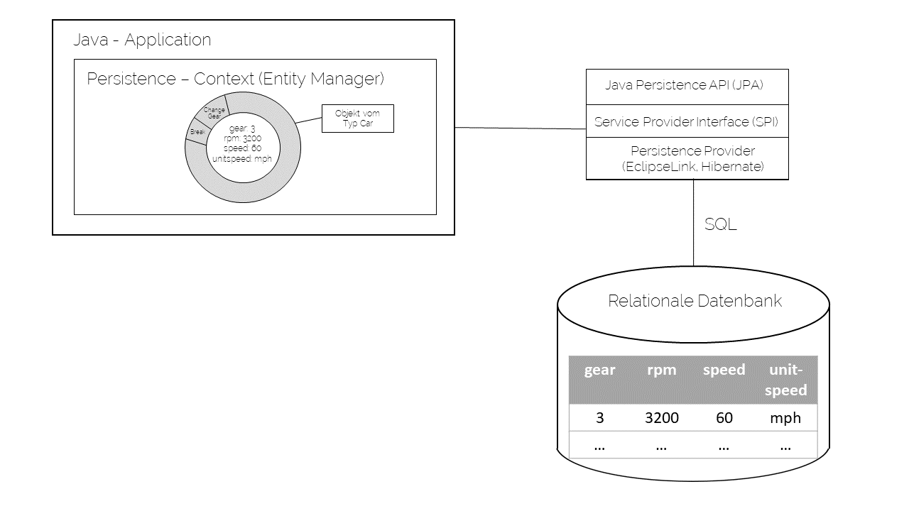
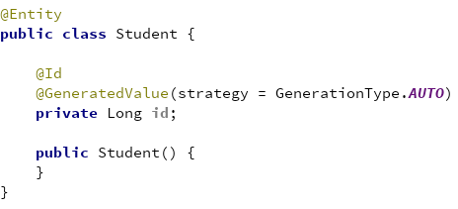
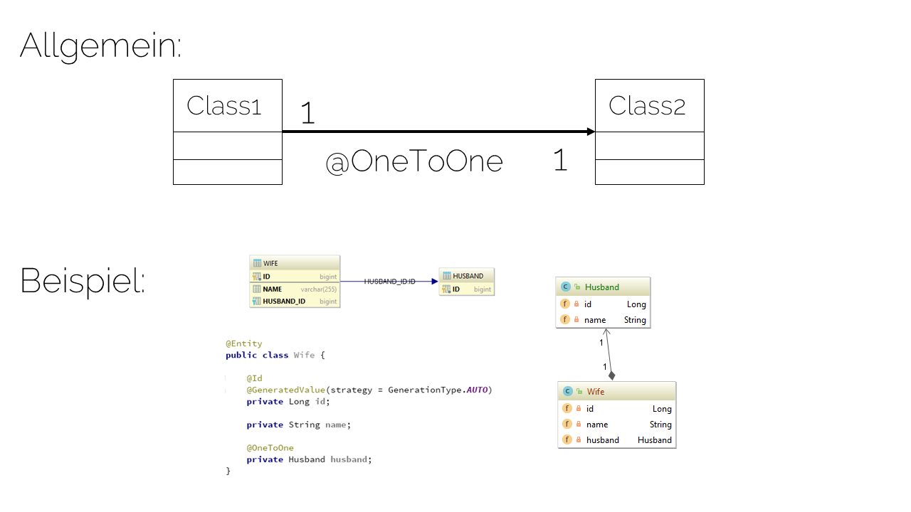
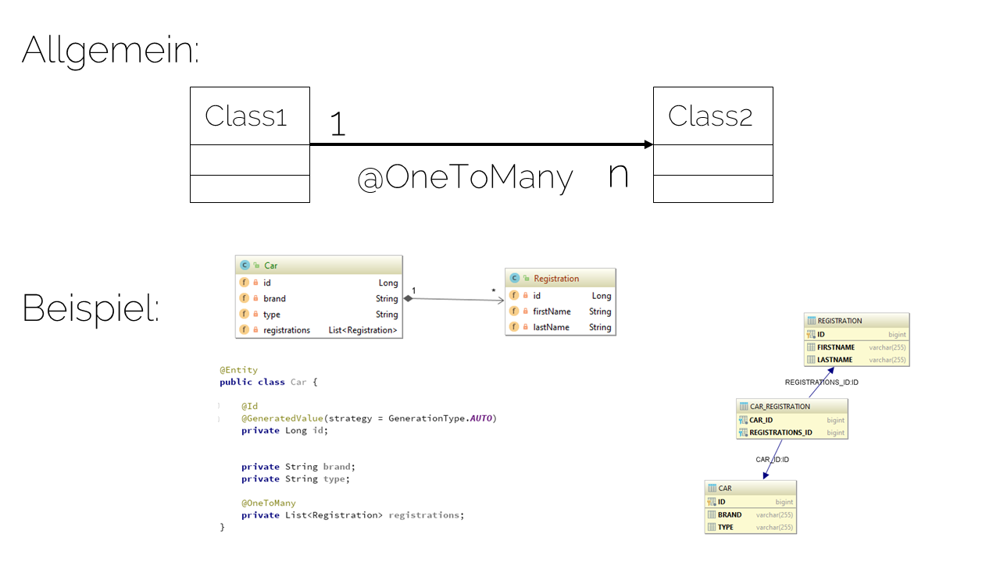
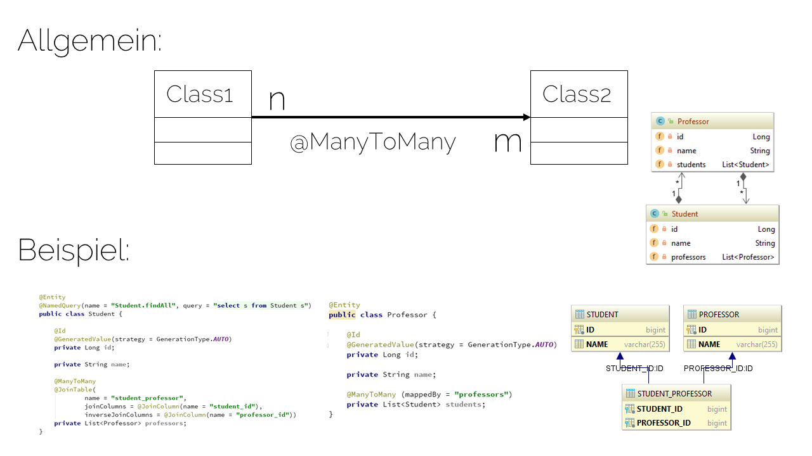
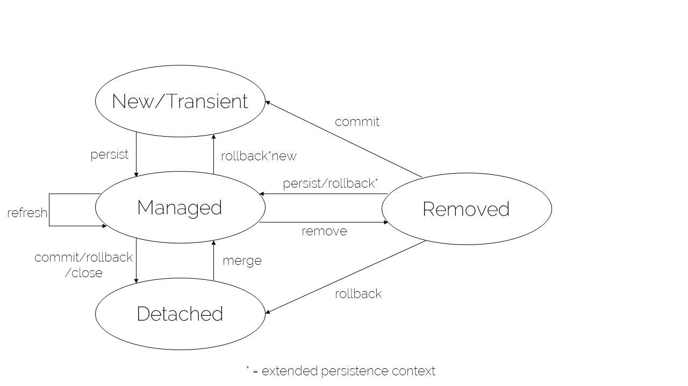
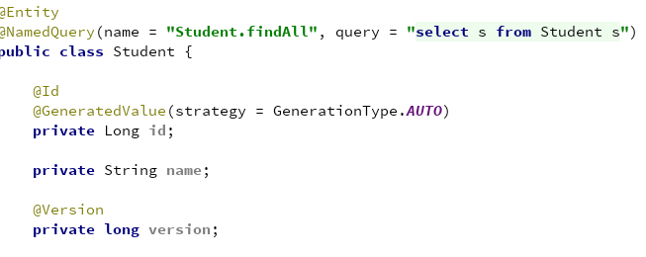
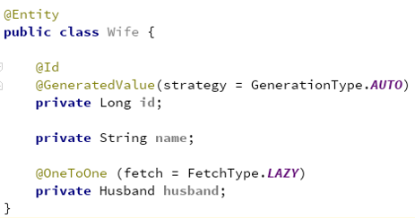

# JPA

## Table of Contents
1. [Allgemeines](#allgemeines)
2. [Grundprinzip](#grundprinzip)
    <br>2.1 [ORM](#orm)<br>
    2.2 [persistence.xml](#persistencexml)
    <br>2.3 [Unterschied JavaSE vs. JavaEE](#unterschied-javase-vs-javaee-maven)
3. [Beziehungen](#beziehungen)
    <br>3.1 [Unterschied Bidirektional vs. Unidirektional](#unterschied-bidirektional-vs-unidirektional)
    <br>3.2 [Arten](#arten)
    <br>3.3 [Aufbau einer Entität](#aufbau-einer-entität)
    <br>3.4 [Id - Vergabe](#id---vergabe)
    <br>3.5 [EntityManager](#entitymanager)
4. [JP-QL](#jp-ql)
5. [CRUD - Operationen](#crud-operationen)
6. [Zustände eines Objektes](#zustände-eines-objektes)
7. [Locking](#locking)
8. [Loading Strategien](#loading-strategien)

## Allgemeines
JPA steht für Java Persistence API. JPA wurde erstmals im Jahr 2006 veröffentlicht. JPA ist nur eine Spezifikation, bzw. ein Interface. Es gibt diverse Frameworks, die das JPA Interface implementieren. Die Referenzimplementierung (Referenz für alle anderen Implementierungen) ist EclipseLink.

* Hibernate: Die weitverbreitetste Implementierung von JPA
* TopLink
* EclipseLink
* Apache OpenJPA

***JPA is the dance, Hibernate is the dancer***

## Grundprinzip
### ORM
JPA ist ein OR - Mapper (Objekt - Relationales Mapping = ORM).
Ein OR – Mapper, hat die Aufgabe eine relationale Datenbank, welche in Tabellen aufgebaut ist, in Objekte einer objektorientierten Programmiersprache (Java, C#, C++) umzuwandeln. Man könnte alternativ, mit JDBC, auf eine Datenbank zugreifen und sich den Wrapper selbst schreiben. In der Praxis wird der direkte Datenbankzugriff mittels JDBC meist nicht gemacht, da es sehr aufwendig und umständlich bzw. fehleranfällig ist. Mit Hilfe von JPA kann man jeden Anwendungsfall, den 
es in einer Objektorientierten Programmiersprache gibt (Vererbung, Collections, etc.) in einer relationalen Datenbank abbilden. Weiteres kümmert sich ein ORM, dass die Datentypen korrekt umgewandelt werden. Sprich in einer relationalen Datenbank, wie z.B. mySQL gibt es keinen Datentyp *string*. Dafür muss der Datentyp *varchar* verwendet werden.

Beispiel: Entität "Car" wird in eine relationale Tabelle verwandelt


### persistence.xml
In JavaEE, sowie JavaSE benötigt man eine persistence.xml - Datei, die sich im resources/META-INF Ordner befinden muss.<br>


Die persistence.xml - Datei ist das zentrale Stück für die Konfiguration.

**Beispiel JavaSE**:
````
<?xml version="1.0" encoding="UTF-8"?>
<persistence xmlns="http://xmlns.jcp.org/xml/ns/persistence" version="2.2">
    <persistence-unit name="dbPU" transaction-type="RESOURCE_LOCAL">
        <class>at.htl.vehicle.entity.Vehicle</class>
        <exclude-unlisted-classes>true</exclude-unlisted-classes>
        <properties>
            <property name="eclipselink.logging.level" value="FINE"/>
            <property name="eclipselink.target-database" value="DERBY"/>
            <property name="javax.persistence.jdbc.driver"
                      value="org.apache.derby.jdbc.ClientDriver"/>
            <property name="javax.persistence.jdbc.url"
                      value="jdbc:derby://localhost:1527/myDb;create=true"/>
            <property name="javax.persistence.jdbc.user" value="app"/>
            <property name="javax.persistence.jdbc.password" value="app"/>
            <property name="javax.persistence.schema-generation.database.action"
                      value="drop-and-create"/>
        </properties>
    </persistence-unit>
</persistence>
````
Datenbank - URL und Credentials müssen ins persistence.xml eingetragen werden. (Vorsicht: Credentials nicht in das VCS (Version Control System) pushen)
Weiteres muss man in JavaSE die zu persistierenden Klasse eintragen. (in diesem Beispiel die Klasse Vehicle)

**Beispiel JavaEE** 
````
<?xml version="1.0" encoding="UTF-8"?>
<persistence xmlns="http://xmlns.jcp.org/xml/ns/persistence" version="2.2">
    <persistence-unit name="dbPU">
        <jta-data-source>java:jboss/datasources/DbDS</jta-data-source>
        <properties>
            <property name="javax.persistence.schema-generation.database.action" value="drop-and-create"/>
            <property name="hibernate.enable_lazy_load_no_trans" value="true"/>
        </properties>
    </persistence-unit>
</persistence>
````

Man benötigt zumindest eine persistence-unit, mit einem Namen. Darin wird dann die Data-Source konfiguriert (Von wo kommen die Daten, bzw. wohin werden sie persistiert). Die Datasource muss am Applikationserver konfiguriert werden. Weiters kann man diverse properties konfigurieren. Dabei gibt es verschiedene Herkünfte, aus den verschiedenen Implementierungen. <br>
zum Beispiel:
* javax       - Property aus dem JPA Interface
* hibernate   - Property aus der Hibernate Implementierung
* eclipselink - Property aus der EclipseLink Implementierung 

Man kann die Properties auch "mischen", sprich Properties aus javax und hibernate verwenden. 

### Unterschied JavaSE vs. JavaEE (Maven)

In einer JavaSE Anwendung muss man folgende Dependencies in das pom.xml eintragen:

````
    <!-- JPA -->
    <dependency>
      <groupId>org.hibernate</groupId>
      <artifactId>hibernate-entitymanager</artifactId>
      <version>${hibernate.version}</version>
    </dependency>
    <!-- For connection pooling -->
    <dependency>
      <groupId>org.hibernate</groupId>
      <artifactId>hibernate-c3p0</artifactId>
      <version>${hibernate.version}</version>
    </dependency>
    <!-- Database -->
    <dependency>
      <groupId>mysql</groupId>
      <artifactId>mysql-connector-java</artifactId>
      <version>5.1.31</version>
    </dependency>
````
https://dzone.com/articles/jpa-tutorial-setting-jpa-java

In einer JavaEE Anwendung muss man lediglich, folgendes dependency in das pom.xml eintragen:
````
<dependency>
    <groupId>jakarta.platform</groupId>
    <artifactId>jakarta.jakartaee-api</artifactId>
    <version>8.0.0</version>
</dependency>
````

### Aufbau einer Entität

Wichtigsten Schritte:
* Entität mit @Entity annotieren
* Primärschlüssel mit @Id kennzeichnen
* leeren Konstruktor erstellen
<br>
Beispiel:



**Wichtig**: Wird kein Applikationserver (Glasfisch, Wildfly, ...) verwendet, sprich JPA in einer JavaSE - Anwendung verwendet, so muss man im persistence.xml die zu persistierenden Klassen eintragen.

Beispiel:

### Id - Vergabe

Für die Primärschlüsselvergabe gibt es folgende 4 Auswahloptionen:

* **Identity:** Der Wert für die Id kommt von der Datenbank
Beispiel:
````
@Id
@GeneratedValue(strategy = GenerationType.IDENTITY)
private Long id;

````

* **Sequence:** Dabei kommt eine Datenbank Sequenz zum Einsatz
Beispiel:
````
@Id
@GeneratedValue(strategy = GenerationType.SEQUENCE)
private Long id;
````
* **Table:** Kommt häufig zum Einsatz, wenn die Datenbank keine Sequenzen unterstützt. Dabei simuliert Java eine Sequenz.
Beispiel:
````
@Id
@GeneratedValue(strategy = GenerationType.TABLE)
private Long id;
````

* **Auto (Default - Value):** Der Persistence Provider entscheidet über die Strategie zur Genierung der Id
Beispiel:
````
@Id
@GeneratedValue(strategy = GenerationType.AUTO)
private Long id;
````

**Quelle:** https://thoughts-on-java.org/jpa-generate-primary-keys/

### EntityManager
**JavaSE:**
Man muss immer eine Transaktion beginnen und anschließend commiten. Dieser Prozess wird in JavaEE automatisch durchgeführt.

````
em.getTransaction().begin();
em.persist(employee);
em.getTransaction().commit();
````

**JavaEE**
Mit der Annotation `@PersistenceContext` wird der EntityManager mit Hilfe von Dependency Injection injiziert. (sie weiteres CRUD Operationen) Man muss in JavaEE keine Transaktion beginnen oder schließen.

## Beziehungen

### Unterschied Bidirektional vs. Unidirektional

Prinzipiell muss man sich sehr genau überlegen, ob man eine bidirektionale oder unidirektionale Verbindung bei den Beziehungen wählt.

Bidirektional bedeutet das man von beiden Objekten auf das jeweils andere zugreifen kann, wobei man ohnehin auf den Assoziationen "surfen" kann.

*Nun wie weiß man jetzt ob man eine bidirektionale Verbindung implementieren soll?* Es kommt auf den Anwendungsfall an. Hat man viele Objekte zu einem jeweils anderen Objekt (z.B. Customer und viele Orders) sollte man am besten eine unidirektionale Verbindung wählen, da es sehr ineffizient wird.

### Arten

**1:1 (OneToOne)**



**1:n (OneToMany)**



**n:m (ManyToMany)**



## JP-QL
JPQL steht für Java Persistence Query Language. Es wird verwendet, um Abfragen für Entitäten zu schaffen, um in einer relationalen Datenbank zu speichern. JPQL wird basierend auf SQL-Syntax entwickelt.
Mit Hilfe von JPQL können Daten unter Verwendung von SELECT-Klausel abgerufen werden, Updates, Deletes, etc. durchgeführt werden.

*Query* (keine Typsicherung):


*TypedQuery* (mit Typsicherung):


*NamedQuery* - Definition: Implementierung direkt in der Entität:


*NamedQuery* - Aufruf:


## CRUD - Operationen

**Create**


**Read**


**Update**


**Delete**


## Zustände eines Objektes (Lifecycle)



Quelle: https://openjpa.apache.org/builds/1.2.3/apache-openjpa/docs/jpa_overview_em_lifecycle.html

Person p = new Person() -> Transient (flüchtig, Gegenteil: persistent (Daten überleben den Prozess, der sie erstellt hat)
Managed: zwischen Objekt und Tabellenzeile ist eine Verbindung p.setName(anderer Name), durch dass das es gemanaged ist, wird automatisch in der Tabelle diese Zeile geändert ohne persistieren
Detached: Verbindung zwischen Tabelle und Objekt wird getrennt, beide existieren aber weitherhin
Removed: Tabellenzeile wird gelöscht

## Locking

**Optimistisches Locking**

Hat einen geringeren Aufwand, und wird eingesetzt, wenn nicht - serialisierbare Transaktionen treten selten auftreten. Die Gültigkeit wird am Ende der Persistierung überprüft. Wird eher bei wenigen User verwendet.

Beispiel: @Version - Field in der Entität implementieren
Tritt ein Konflikt ein wird eine OptimisticLockException geworfen.



Optimistischer Read:


Optimistisches Refresh:


(Refresh aktualisiert das Objekt von der Datenbank)

**Pessimitisches Locking**

Ist ein Sperrverfahren, welches einen höheren Aufwand als das optimistische Locking hat. Die Datensätze werden exklusiv gesperrt. Wahrscheinlichkeit für nicht- serialisierbare Transaktionen (Transaktionen kommen beim gleichzeitigen Ausführen zum gleichen Ergebniss, wie wenn man sie hintereinander ausführt) ist hoch. Wird eher bei vielen Usern implementiert.

Beispiel: Pessimistisches Lesen


## Loading Strategien

**Eager**: Das Objekt in der Assoziation wird immer geladen, sprich alle in Beziehung stehenden Objekte werden auf einmal geladen.


**Lazy**: Das Objekt in der Assoziation wird erst bei Abruf geladen.


