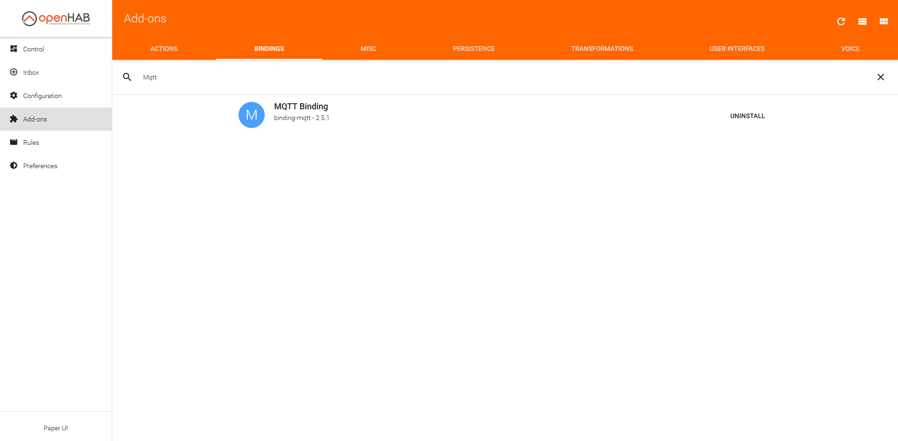
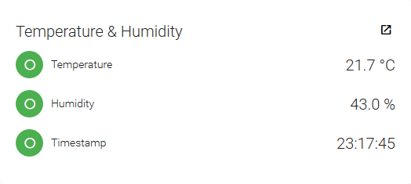
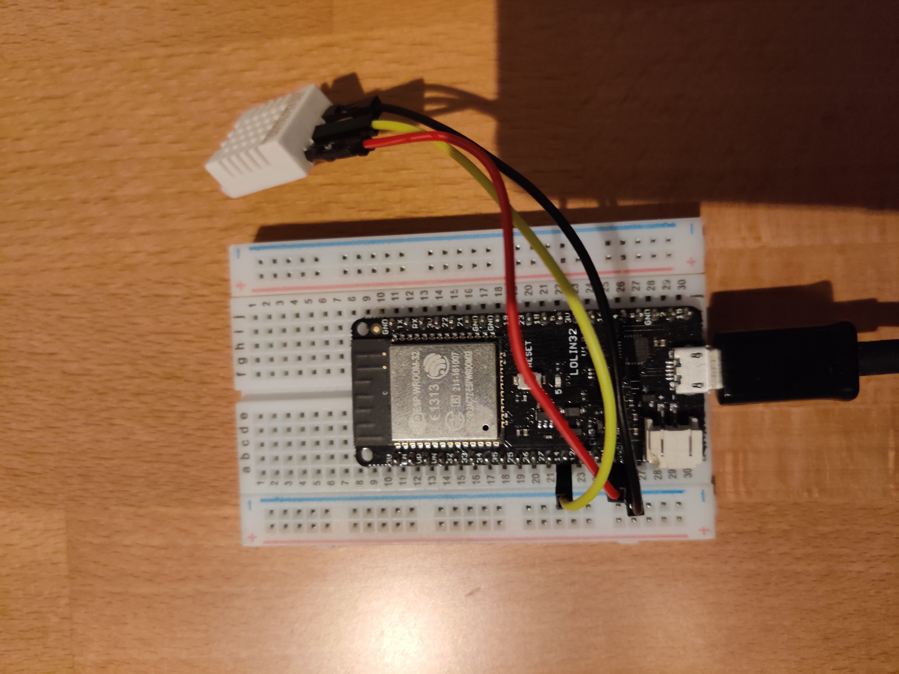
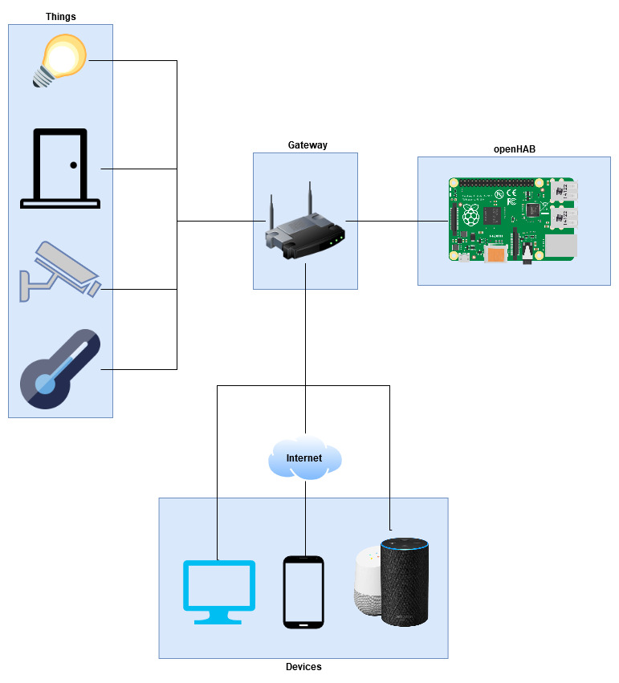

= OpenHAB
Nenad Tripic <tripicnenad@hotmail.com>
v1.0, 2020-03-13
:toc:
:toc-title: Table of contents
:toclevels: 3

ifdef::env-github[]
:tip-caption: :bulb:
:note-caption: :information_source:
:important-caption: :heavy_exclamation_mark:
:caution-caption: :fire:
:warning-caption: :warning:
endif::[]

=== What is openHAB?
open Home Automation Bus (openHAB) is an open source home automation software written in Java. It is deployed on premise and connects to devices and services from different vendors. As of 2020, close to 300 bindings are available as OSGi modules. Actions, such as switching on lights, are triggered by rules, voice commands, or controls on the openHAB user interface.

https://www.openhab.org/[Further details and download openHAB]

=== What can you do with the content of this directory?
With the content of this directory you can locally setup openHab which gets and displays the current temperature and humidity which was measured from the ESP32 and sent from it as a message via a MQTT-Broker. Basically all you have to do is to flash a ESP32 and run docker-compose. Configuration of openHAB is explained a little bit later.

== What is in this directory? 

==== Presentation
In this directory you can find the presentation that I held.

=== Software

==== Docker-compose - docker a instance of OpenHAB and a MQTT-Broker
Furthermore you will find a docker compose file to instantly start up a openHAB instance and a MQTT-Broker. With this setup you are able to implement a simple setup to test it but it is also powerful enough for you raspberry to implement it for your home. You can start up the the docker containers by
----
docker-compose up
----
Then you can reach the openHAB site via localhost:8080 and start with the installation. I would recommend you to do the "easy setup" for beginners. After that you can download the MQTT-Binding in the paper UI and then start configuring it. I would suggest you to read threw the documentation of the add on https://www.openhab.org/addons/bindings/mqtt/[MQTT-Binding]. In the following figure you can see how it should look like when you want to install it and in the next picture how the control panel look when you implement the MQTT-Binding and flash the ESP32 to send data.

==== ESP32 - Software
In order to display some footage via the MQTT-Broker you can flash a ESP32 with the software I provided in this [directory]. I would highly recommend flashing this software via VS Code and the extension https://platformio.org/[PlatformIO]. 

IMPORTANT: One thing before you flash it: change the credentials in the main.cpp
[code,C]
----
//credentials for wifi
const char *ssid = "YOUR-SSID";
const char *pass = "YOUR-PASS";

//credentials for mqtt-broker
const char *brokerIP = "MQTT-BROKER-IP";
const char *brokerUser = "user";
const char *brokerPass = "pass";
const int mqttPort = 1883;
----

TIP: If necessary, you should also change the pin where your DHT22-Sensor is connected to.
....
#define DHTPIN 14 //the digital pin to read from
....

With this program the ESP32 sends you every 10 seconds the temperature and humidity it measures and sends them on specific topics. Read the code for more information, it is pretty straight forward. If you need help, do not hesitate to ask me for help.

=== Hardware
==== ESP32 + DHT22
The ESP32 is a cheap and most importantly programmable microcontroller, which can basically serve as anything if you are creative enough. You can program it on your own in C or C++. In combination with the DHT22, a temperature and humidity sensor, you can measure the air and then send the value via MQTT. In the following figure you will see how I connected my ESP32 with the DHT22 using the port 14.

== Typical systemdiagram
Here you can see a typical systemdiagram. 

