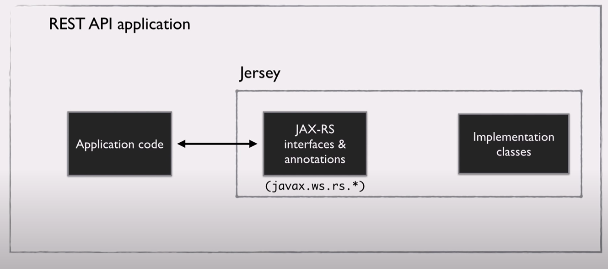

= REST Client (Nico Vasquez)
:toc:

== JAX RS
In Java gibt es viele Libraries (File lesen, Collections behandeln, etc).
Für das Erstellen von REST APIs gibt es auch Libraries, wie REST Easy, RESTlet oder Jersey.

All diese Libraries implementieren ein gemeinsames Interface -> *JAX RS*

JAX RS beinhaltet die Interfaces & Annotationen. Jersey, REST Easy etc. implementieren JAX RS und bringen die Funktionalitäten mit sich .

Man muss JAX-RS nicht händisch includen, da REST Libraries mit einer Kopie von diesen API Klassen kommen. So muss man nur die Library in der Applikation includen und schon kann man es z.b auf einen Tomcat deployen.

Ein großer Vorteil ist dass man so die Libraries einfach austauschen kann, weil die Applikation von den 
API Klassen von JAX RS abhängig ist.

== REST Clients

=== Jersey

Warum Jersey? Jersey ist eine Referenzimplementierung von JAX RS - also eine Implementierung die zeigt wie es funktionieren könnte und wird Referenz für alle anderen Implementierung desselben Standards angesehen.

...

=== REST EASY

RESTEasy ist genauso eine Implementierung von JAX RS. Einziger Unterschied ist, dass RESTEasy eine engere Integration mit JBoss Application server hat (Wildfly). Man kann es aber dennoch auf anderen Servlet Containern deployen (Tomcat etc.)

...

== Beispiel Projekte

link:resteasy-example[RESTEasy Projekt]

.Info
Einfaches RESTEasy Beispiel mit einem LoggingFilter, der REST-Aufrufe intercepted und ausgibt 

link:simple-service[Jersey Projekt]

.Info
Ein Jersey REST Client mit einem Authentifizierung-Filter, der auf einem Grizzly HTTP Server deployed ist.

== Links

* https://www.youtube.com/watch?v=BuYivu9ZjDw
* https://howtodoinjava.com/jersey/jersey-restful-client-examples/
* https://www.codeflow.site/de/article/resteasy-tutorial
* https://www.baeldung.com/jersey-jax-rs-client