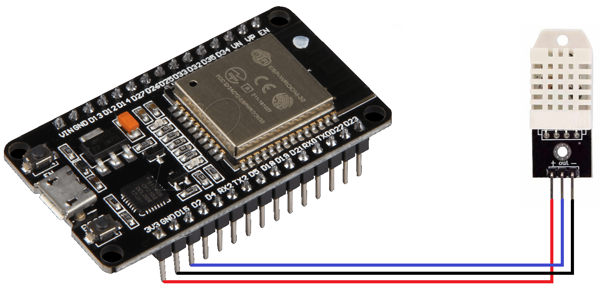
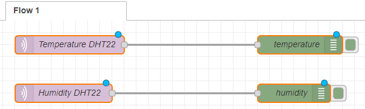

# Guide

### Requirements

You will need the following hardware:

* ESP32
* DHT22
* 3 f-f Dupont wires
* micro-USB to USB cable
* computer

You will need the following software installed:

* the esp-idf toolchain (you can find a tutorial for that https://docs.espressif.com/projects/esp-idf/en/latest/esp32/get-started/[here])
* some kind of text editor
* Docker
* https://nodered.org/[Node-RED]
* https://www.hivemq.com/blog/mqtt-cli/[HiveMQ MQTT CLI] (for testing)

### Hardware Setup

Now you will need the ESP32, the DHT22 and the three Dupont wires.
The colour of the wires is irrelevant, it is common though to use red and black wires for the power pins.

Connect the following pins:

* the GND pin of the ESP32 with the - pin of the DHT22 (preferably with a black wire)
* the 3.3V pin of the ESP32 with the + pin of the DHT22 (preferably with a red wire)
* your prefered data pin of the ESP32 with the out pin of the DHT22 (again the color is irrelevant, just try not to use the same colour again that will make error handling easier)

You also need to connect he ESP to your computer with the micro USB to USB cable.

### Software Setup

#### Read Data from DHT22

Clone https://github.com/gosouth/DHT22[this] repository from GitHub

It is a simple program that will output the humidity and the temperature that the DHT22 reads to the serial monitor

For it to work you will need to change the DHT-pin in line 23 according to the pin you installed the out pin of the DHT22 sensor on the ESP32
[source,c]
----
setDHTgpio( <your pin-number> );
----

To check if you were successful this far you can run the program with the following command in the project directory
[source,bash]
----
make flash monitor
----

#### MQTT extension

To enable the ESP to send data over an MQTT network you first need to start one.

You can do this with the following command:

[source,bash]
----
sudo docker run -p 1883:1883 eclipse-mosquitto
----

##### MQTT test
Before you proceed I recommend to test if the MQTT Broker you just started is working as intended.

You can do this by opening two new terminals. First you want to subscribe to all topics of the broker in one terminal with:

[source,bash]
----
sudo mqtt sub -t #
----

Then you want to publish a message in the other terminal and check if it shows up on the terminal you just subscribed to all topics.

You can do this with the following command:

[source,bash]
----
sudo mqtt pub -t test -m "this is a test"
----

if the message shows up everything is working fine

#### Enabling MQTT publishing on the ESP32

For the ESP to be able to send messages over MQTT you need a few extra libraries. They are all provided in the "extra_libs" folder. There also is a projbuild file, which you need to set the router and the password the ESP32 should connect to.

Take all the files in the "extra_libs" folder and copy them into the *main* folder of the GitHub repository you cloned before.

Now you will need to change the DHT_main.c file a bit.

First you need to include the following files:

* mqtt.h
* wifi.h

Then you need to add a few things to the function *app_main* so that it looks like this:

[source,c]
----
void app_main()
{
    nvs_flash_init();

	wifi_init_sta();
	while(get_is_connected() == false){
		vTaskDelay( 100 / portTICK_RATE_MS );
		printf("%d\n", get_is_connected());
	};

	mqtt_start();
	vTaskDelay( 1000 / portTICK_RATE_MS );
	xTaskCreate( &DHT_task, "DHT_task", 2048, NULL, 5, NULL );
}
----

The code you added will make it so the ESP32 connects to the wifi and starts the mqtt library after it is successfully connected.

Now the ESP32 is connected to your MQTT Broker but is not sending messages yet.

To send messages over the MQTT network you need to change the *DHT_task* function so it looks like this:

[source,c]
----
void DHT_task(void *pvParameter)
{
	setDHTgpio( <your GPIO-Pin number> );
	while(1) {
	
		printf("=== Reading DHT ===\n" );
		int ret = readDHT();
		
		errorHandler(ret);

		printf( "Hum %.1f\n", getHumidity() );

		printf( "Tmp %.1f\n", getTemperature() );
		
		mqtt_msg_t msg ={0};
		snprintf(msg.topic, 20, "temperature");
   		snprintf(msg.payload, 100, "%f", getTemperature());
		mqtt_publish_msg(&msg);
		snprintf(msg.topic, 20, "humidity");
   		snprintf(msg.payload, 100, "%f", getHumidity());
        	mqtt_publish_msg(&msg);

		// -- wait at least 2 sec before reading again ------------
		// The interval of whole process must be beyond 2 seconds !! 
		vTaskDelay( 3000 / portTICK_RATE_MS );
	}
}
----

This code will send the temperature and the humidity over the topics "temperature" and "humidity", so if some device is subscribed to one of those topics they will read that data every 2 seconds.

*IMPORTANT !!!!*

Before you flash the program to the ESP32, you need to enter to things into the config of the ESP32.

To enter the config of the ESP run the following command in the project dirrectory:

[source,bash]
----
make menuconfig
----

this will take you to the config of the ESP, now go to *Example Configuration* and enter your router ssid into *MESH_ROUTER_SSID* and you router password into *MESH_ROUTER_PASSWD* and save.

Now you can flash the Program onto the ESP32 via:

[source,bash]
----
make flash monitor
----

### Monitoring via Node-RED

To monitor the data of your DHT22 you can create a small flow in Node-RED.

To subscribe to the topic you want you need the node *mqtt in* it is in the *network* category.

Drag it onto your Flow and double click it to configure the properties.

You will need to create a new server. Give the server a name and set the server-ip to localhost and the port to 1883 since that is what the server is running on in the terminal. Then click add.

You also need to select a topic to subscribe to.

Now the easiest way to see the output is to do it via the *debug* node in the *common* category. Drag it onto your flow and connect it to your *mqtt in* node.

To see if it worked click the red *deploy* button in the top right corner

and then click the little bug button

to open the debug window and see the messages the are being sent in that topic.
